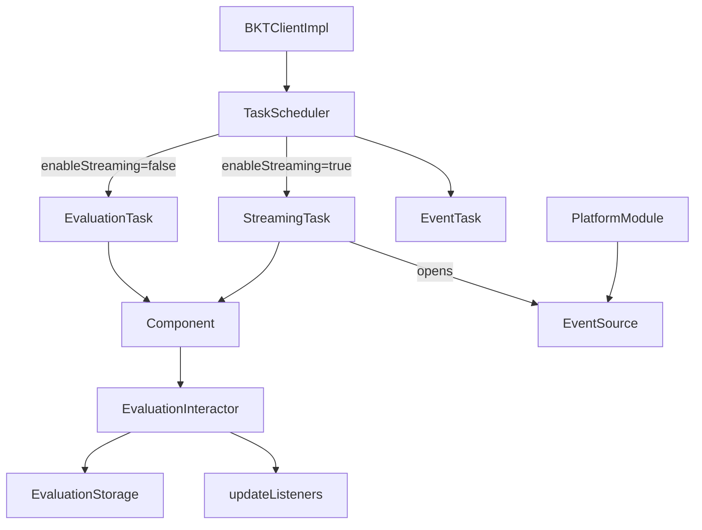
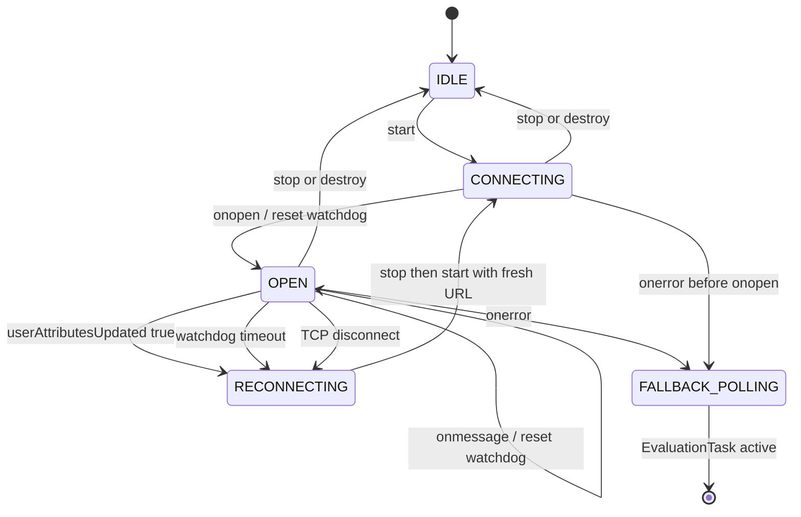
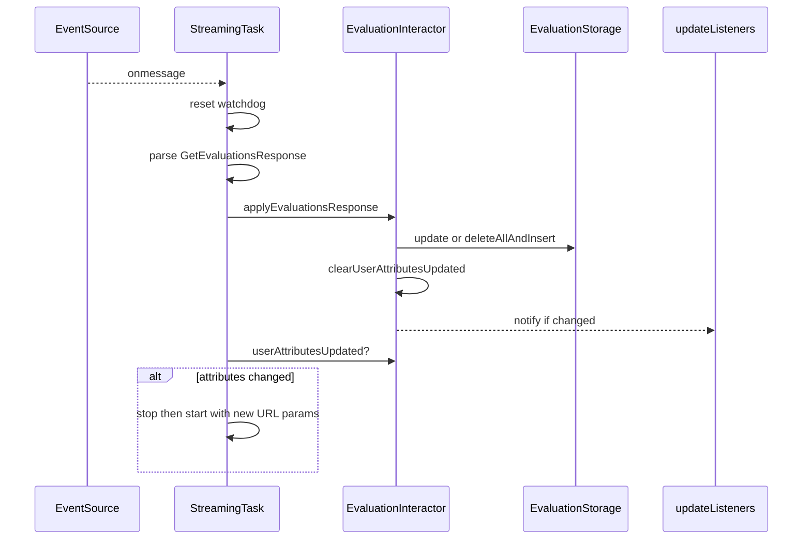

# SSE Implementation Plan: JavaScript SDK

Real-time feature flag updates via Server-Sent Events. Opt-in, falls back to polling on failure.

---

## RFC Alignment (bucketeer-io/bucketeer PR #2561)

| RFC lifecycle point | Status |
|---|---|
| Connect with tag + user; polling fallback on failure | Covered — `streamingFallbackToPolling` + Gap 2 URL params below |
| Server sends periodic heartbeat (~30 s) | Covered — `: heartbeat` SSE comments; SDK ignores them (native behavior) |
| User-attribute change → reconnect with new attributes | **Gap 1** — requires explicit reconnect logic in `StreamingTask` |
| On disconnect → reconnect | Covered — native `EventSource` auto-reconnect; Gap 3 covers silent partitions |

**Three gaps to implement:**
- **Gap 1:** After each evaluation apply, check `userAttributesUpdated()` and reconnect if true.
- **Gap 2:** SSE is a GET request — `tag`, `userId`, user attributes, `userEvaluationsId` must be query params.
- **Gap 3:** Heartbeat watchdog timer to detect silent network partitions (TCP stays open, events stop).

---

## Key Technical Facts (verified in source)

| Concern | Source | Constraint |
|---|---|---|
| Config defaults | `src/BKTConfig.ts` `defineBKTConfig` L86–155 | New options use `??` defaults + validation block throwing `IllegalArgumentException` |
| Auth | `ApiClientImpl.createHeaders()` | Header auth (`Authorization: apiKey`) is default; query-param is browser-only fallback |
| Scheduler contract | `src/internal/scheduler/` | `ScheduledTask { isRunning(); start(); stop() }`; `TaskScheduler` builds `[EvaluationTask, EventTask]` |
| Update propagation | `EvaluationInteractor.fetch` L51–81 | `forceUpdate ? deleteAllAndInsert : update` → `clearUserAttributesUpdated` → notify `updateListeners` |
| SSE payload | Existing models | Reuse `GetEvaluationsResponse { evaluations: UserEvaluations, userEvaluationsId }` |
| DI graph | `src/internal/di/` | `PlatformModule` is the right place to inject `EventSource` per platform |
| Lifecycle hooks | `BKTClientImpl` L305, L310, L379 | `scheduleTasks` / `resetTasks` / `destroyBKTClient` — cleanup flows through `resetTasks` |
| User attribute flag | `EvaluationInteractor` | `userAttributesUpdated(): boolean` — set via `setUserAttributesUpdated` |

---

## Design Diagrams

### 1. Component architecture



### 2. Connection state machine



### 3. onmessage data flow



---

## Implementation

### 1. Config — `src/BKTConfig.ts` (L86–155)

Add to `RawBKTConfig`:
```ts
eventSource?: EventSourceLike
enableStreaming?: boolean
streamingFallbackToPolling?: boolean
```

Add to `BKTConfig` (resolved, non-optional):
```ts
enableStreaming: boolean
streamingFallbackToPolling: boolean
```

In `defineBKTConfig` result literal:
```ts
eventSource: config.eventSource ?? globalThis.EventSource,
enableStreaming: config.enableStreaming ?? false,
streamingFallbackToPolling: config.streamingFallbackToPolling ?? true,
```

Add validation block (after existing `fetch` check, near L131):
```ts
if (result.enableStreaming && !result.eventSource) {
  throw new IllegalArgumentException(
    'enableStreaming requires an EventSource implementation. ' +
    'Provide config.eventSource (e.g. "eventsource" for Node.js)',
  )
}
```

---

### 2. New file — `src/internal/streaming/EventSourceLike.ts`

```ts
export interface EventSourceLike {
  new(url: string, init?: EventSourceInit): EventSourceInstance
}

export interface EventSourceInstance {
  readonly readyState: number
  onopen: ((ev: Event) => void) | null
  onmessage: ((ev: MessageEvent) => void) | null
  onerror: ((ev: Event) => void) | null
  close(): void
}

export interface EventSourceInit {
  headers?: Record<string, string>  // supported by eventsource + react-native-sse
}
```

---

### 3. New file — `src/internal/streaming/StreamingTask.ts`

Implements `ScheduledTask`. Holds `Component`.

**`start()`** — build URL with all required query params *(Gap 2)*:
- Params: `tag`, `userId`, user attributes serialized, `userEvaluationsId`
- Browser native EventSource: also append `apiKey=…` (no header support)
- Node/RN polyfills: pass `{ headers: { Authorization: apiKey } }` in init instead

**`onopen`** — reset heartbeat watchdog timer *(Gap 3)*.

**`onmessage`**:
1. Reset watchdog timer
2. `JSON.parse(event.data)` → `GetEvaluationsResponse`
3. `evaluationInteractor.applyEvaluationsResponse(response)`
4. If `evaluationInteractor.userAttributesUpdated()` → `stop()` then `start()` *(Gap 1)*

**Watchdog timer** — `setTimeout` at `2 × heartbeat_interval` (~60 s). On fire: close + reopen `EventSource` *(Gap 3)*. Cancelled in `stop()`.

**`onerror`** — if `streamingFallbackToPolling`: `stop()` then start a new `EvaluationTask`. Otherwise let native auto-reconnect handle it.

**`stop()`** — cancel watchdog, `close()` the `EventSource`.

---

### 4. Modify — `src/internal/evaluation/EvaluationInteractor.ts` (L51–81)

Extract the apply block into a new public method:
```ts
async applyEvaluationsResponse(response: GetEvaluationsResponse): Promise<void> {
  // forceUpdate ? storage.deleteAllAndInsert : storage.update
  // clearUserAttributesUpdated()
  // notify updateListeners if changed
}
```
Have existing `fetch` call `applyEvaluationsResponse`. SSE reuses the same method — identical cache + listener semantics.

---

### 5. Modify — `src/internal/di/PlatformModule.ts` + `.browser.ts` + `.node.ts`

Add to the `PlatformModule` interface:
```ts
eventSource(): EventSourceLike | undefined
```

- `PlatformModule.browser.ts` → returns `globalThis.EventSource`
- `PlatformModule.node.ts` / base → returns `config.eventSource`

---

### 6. Modify — `src/internal/scheduler/TaskScheduler.ts`

```ts
const schedulers = [
  config.enableStreaming ? new StreamingTask(component) : new EvaluationTask(component),
  new EventTask(component),
]
```

`EventTask` is unchanged.

---

### 7. Auth per platform

| Platform | EventSource | Auth |
|---|---|---|
| Browser | `globalThis.EventSource` (native) | `apiKey` as query param |
| Node.js | `eventsource` npm package | `Authorization` header via `EventSourceInit.headers` |
| React Native | `react-native-sse` npm package | `Authorization` header via `EventSourceInit.headers` |

---

### 8. Reconnect & fallback

| Scenario | Behavior |
|---|---|
| Backend lacks SSE | `onerror` before `onopen` → `streamingFallbackToPolling` → `EvaluationTask` |
| Transient disconnect (TCP close) | Native `EventSource` auto-reconnects with `Last-Event-ID` |
| Silent network partition | Watchdog fires after ~60 s → close + reopen *(Gap 3)* |
| User attributes changed | `userAttributesUpdated()` true → `stop()` + `start()` with new URL *(Gap 1)* |
| No `EventSource` available | Validation error at `defineBKTConfig` time |
| `destroy()` called | `StreamingTask.stop()` cancels watchdog + closes `EventSource` |

---

## Usage Examples

```ts
// Browser — native EventSource, zero config
initializeBKTClient({ apiKey, apiEndpoint, appVersion, enableStreaming: true })

// Node.js
import EventSource from 'eventsource'
initializeBKTClient({ apiKey, apiEndpoint, appVersion, enableStreaming: true, eventSource: EventSource })

// React Native
import EventSource from 'react-native-sse'
initializeBKTClient({ apiKey, apiEndpoint, appVersion, enableStreaming: true, eventSource: EventSource })
```

---

## Testing

- **Unit** (Vitest, `test/`): fake `EventSourceLike` driving `onopen/onmessage/onerror`; assert storage updated + listeners fired; assert `TaskScheduler` picks correct task; assert config validation throws when `enableStreaming && !eventSource`.
- **E2E** (`e2e/`): flip flag on backend, assert SDK receives update via SSE in < 1 s.

---

## Effort

| | |
|---|---|
| New files | 2 — `EventSourceLike.ts`, `StreamingTask.ts` |
| Modified files | ~6 — `BKTConfig.ts`, `EvaluationInteractor.ts`, `PlatformModule.ts` + `.browser` + `.node`, `TaskScheduler.ts` |
| Blocking dependency | Backend SSE endpoint |
| Backward compatibility | Polling default unchanged; SSE strictly opt-in; no public API change |
