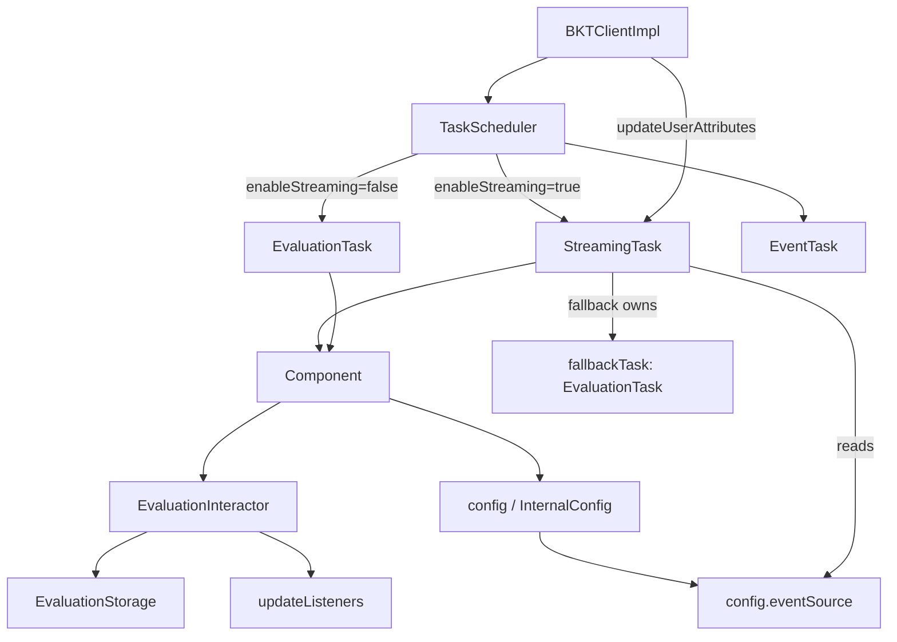
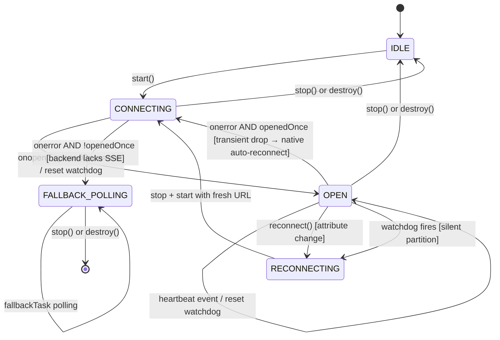
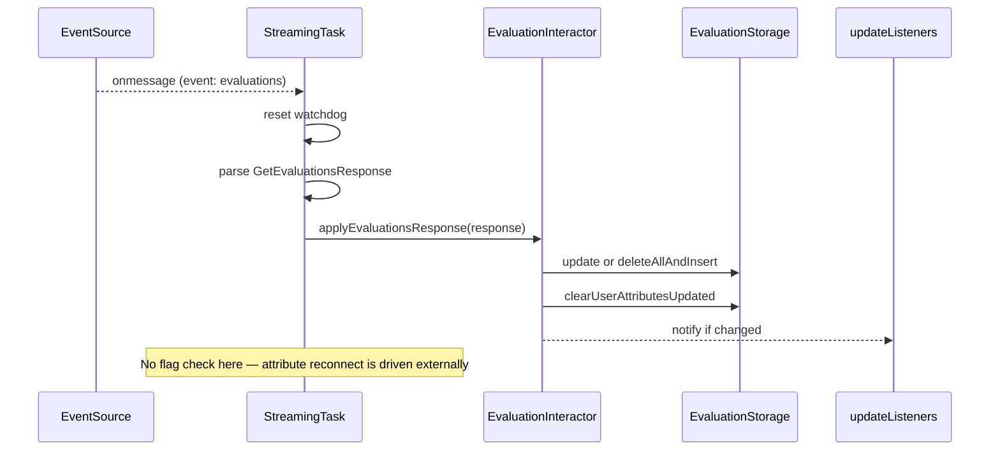
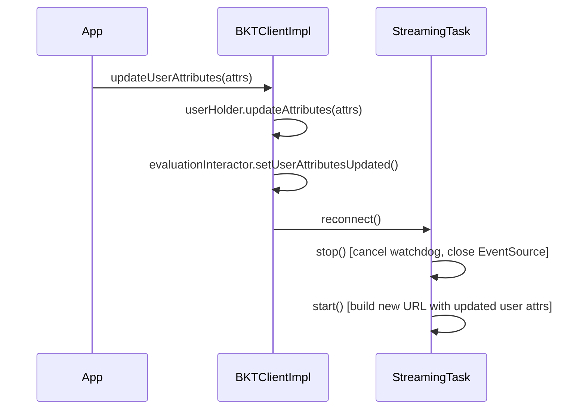

# SSE Implementation Plan V2: JavaScript SDK

Supersedes [`SSE_IMPLEMENTAION.md`](./SSE_IMPLEMENTAION.md). All 8 findings from
[`SSE_IMPLEMENTATION_REVIEWED.md`](./SSE_IMPLEMENTATION_REVIEWED.md) are
incorporated. The file-level structure (opt-in config, reuse of
`GetEvaluationsResponse`, extracting `applyEvaluationsResponse`, scheduler swap,
backward compatibility) is preserved — only the runtime connection lifecycle and
interface are corrected.

---

## Changes from V1

| Finding | Severity | V1 Problem | V2 Fix |
|---|---|---|---|
| 1 | Critical | Heartbeat `: heartbeat` SSE comments don't fire `onmessage` → watchdog reconnect loop while idle | Backend emits named `heartbeat` event; watchdog reset by `addEventListener('heartbeat')` + `onmessage` + `onopen` |
| 2 | Critical | `onerror` always falls back to polling (default `streamingFallbackToPolling: true`) → drops streaming on first network blip | Track `openedOnce` flag; only fall back when `!openedOnce` (backend never opened SSE); transient drops let native auto-reconnect run |
| 3 | Critical | Reconnect triggered from `onmessage` after `clearUserAttributesUpdated()` clears the flag first → never fires | Drive reconnect from `updateUserAttributes()` call site, not from `onmessage`; `StreamingTask.reconnect()` called externally |
| 4 | High | `userAttributesUpdated(): boolean` sync getter assumed but doesn't exist; real getter is async + Mutex-guarded on storage | Finding 3 fix eliminates the need for this getter in `onmessage`; no false sync API assumed |
| 5 | High | Fallback `EvaluationTask` spawned inside `StreamingTask` but not owned/stopped there → polling leak after `destroy()` | `StreamingTask` holds `fallbackTask` field and stops it in its own `stop()` |
| 6 | Medium | `EventSourceLike` exposes only `onmessage` → named events (`event: evaluations`, `event: heartbeat`) never received | `EventSourceLike` adds `addEventListener` / `removeEventListener` |
| 7 | Medium | `PlatformModule.eventSource()` unimplementable: Node/Base modules receive no `config`, only `idGenerator` | Drop `PlatformModule` injection; read `eventSource` from `config()` directly in `StreamingTask` |
| 8 | Medium | `apiKey` in browser URL query string lands in server/proxy logs and browser history | Add Security section; document the exposure; recommend short-lived streaming keys |

---

## RFC Alignment (bucketeer-io/bucketeer PR #2561)

| RFC lifecycle point | Status |
|---|---|
| Connect with tag + user; polling fallback on failure | Covered — `streamingFallbackToPolling` + Gap 2 URL params |
| Server sends periodic heartbeat (~30 s) | Covered — **named `heartbeat` event** (not SSE comment); SDK resets watchdog via `addEventListener('heartbeat')` |
| User-attribute change → reconnect with new attributes | Covered — `updateUserAttributes()` signals `StreamingTask.reconnect()` |
| On disconnect → reconnect | Covered — native `EventSource` auto-reconnect; watchdog catches silent partitions |

**Three gaps (corrected):**
- **Gap 1:** `updateUserAttributes()` signals `StreamingTask.reconnect()` with a freshly built URL.
- **Gap 2:** SSE is a GET request — `tag`, `userId`, user attributes, `userEvaluationsId`, `sourceId`, `sdkVersion` must be query params.
- **Gap 3:** Heartbeat watchdog timer to detect silent network partitions; reset by named `heartbeat` events, not SSE comments.

---

## Key Technical Facts (re-verified against source)

| Concern | Source | Constraint |
|---|---|---|
| Config defaults | `src/BKTConfig.ts` `defineBKTConfig` | `??` defaults + conditional assignment for advanced keys (`no-spread-after-defaults` rule); validation throws `IllegalArgumentException` |
| Auth | `ApiClientImpl.createHeaders()` L122–125 | Header auth (`Authorization: apiKey`) for all platforms that support init headers; query-param only for browser native `EventSource` |
| Scheduler contract | `src/internal/scheduler/` | `ScheduledTask { isRunning(); start(); stop() }`; `TaskScheduler` builds fixed array, `stop()` only stops what's in it |
| Update propagation | `EvaluationInteractor.ts` L51–81 | `forceUpdate ? deleteAllAndInsert : update` → `clearUserAttributesUpdated()` at L76 → notify `updateListeners` |
| Attribute update path | `BKTClient.ts` L177–182 | `updateUserAttributes()` calls `setUserAttributesUpdated()` — independent of incoming SSE messages |
| Attribute getter | `EvaluationStorage.ts` L193–198 | `getUserAttributesUpdated()` is **async + Mutex-guarded**; interactor exposes only `setUserAttributesUpdated()` (L90) — no sync read available |
| SSE payload | Existing models | Reuse `GetEvaluationsResponse { evaluations: UserEvaluations, userEvaluationsId }` |
| DI graph | `src/internal/di/PlatformModule{,.browser,.node}.ts` | `PlatformModule` / `BasePlatformModule` / `NodePlatformModule` receive **no config** — only `idGenerator`; cannot inject `EventSource` here |
| Config access in tasks | `src/internal/di/Component.ts` | `Component.config()` returns `InternalConfig`; all tasks receive `Component` — read `eventSource` from there |
| Lifecycle hooks | `BKTClientImpl` L305–315 | `scheduleTasks` / `resetTasks` — cleanup flows through `taskScheduler.stop()` which calls each task's `stop()` |

---

## Design Diagrams

### 1. Component architecture (corrected)



> `EventSource` comes from `config()` in `StreamingTask`, not from `PlatformModule`.
> `StreamingTask.stop()` is responsible for stopping both the `EventSource` and any owned `fallbackTask`.

---

### 2. Connection state machine (corrected)



Key corrections from v1:
- `onerror` branches on `openedOnce`: transient drops stay in streaming; only never-opened drops to polling.
- Watchdog reset includes named `heartbeat` events (not SSE comments).
- Attribute-change reconnect is driven externally (from `updateUserAttributes`), not from inside `onmessage`.

---

### 3. `onmessage` data flow (corrected — no flag check inside)



### 4. Attribute-change reconnect flow (new)



---

## Implementation

### 1. Config — `src/BKTConfig.ts`

Add to `RawBKTConfig`:
```ts
// User-provided EventSource constructor (required for Node.js / React Native)
eventSource?: EventSourceLike
// Enable SSE streaming (default: false — polling is unchanged default)
enableStreaming?: boolean
// Fall back to polling when SSE never opens (default: true)
streamingFallbackToPolling?: boolean
```

Add to `BKTConfig` (resolved):
```ts
eventSource: EventSourceLike | undefined
enableStreaming: boolean
streamingFallbackToPolling: boolean
```

In `defineBKTConfig` result literal (follow `??` pattern, no spread):
```ts
eventSource: config.eventSource ?? globalThis.EventSource,
enableStreaming: config.enableStreaming ?? false,
streamingFallbackToPolling: config.streamingFallbackToPolling ?? true,
```

Add validation block (after existing `fetch` check):
```ts
if (result.enableStreaming && !result.eventSource) {
  throw new IllegalArgumentException(
    'enableStreaming requires an EventSource implementation. ' +
    'Provide config.eventSource (e.g. the "eventsource" npm package for Node.js)',
  )
}
```

> The `eventSource` field is a constructor (`EventSourceLike`), not an instance.
> It follows the same pattern as `fetch: config.fetch ?? globalThis.fetch`.
> Per the `no-spread-after-defaults` ESLint rule, do not spread `config` over `result` — assign conditionally.

---

### 2. New file — `src/internal/streaming/EventSourceLike.ts`

```ts
export interface EventSourceLike {
  new(url: string, init?: EventSourceInit): EventSourceInstance
}

export interface EventSourceInstance {
  readonly readyState: number
  readonly CONNECTING: 0
  readonly OPEN: 1
  readonly CLOSED: 2
  onopen: ((ev: Event) => void) | null
  onmessage: ((ev: MessageEvent) => void) | null
  onerror: ((ev: Event) => void) | null
  addEventListener(type: string, listener: (ev: MessageEvent) => void): void
  removeEventListener(type: string, listener: (ev: MessageEvent) => void): void
  close(): void
}

export interface EventSourceInit {
  // Supported by 'eventsource' (Node.js) and 'react-native-sse'
  // Not supported by browser native EventSource
  headers?: Record<string, string>
}
```

Both `eventsource` (Node.js) and `react-native-sse` implement `addEventListener` /
`removeEventListener`. Browser native `EventSource` also supports them. This fixes
finding #6.

---

### 3. New file — `src/internal/streaming/StreamingTask.ts`

Implements `ScheduledTask`. Holds `Component`. Reads `eventSource` from `config()`.

```ts
import { Component } from '../di/Component'
import { EvaluationTask } from '../scheduler/EvaluationTask'
import { ScheduledTask } from '../scheduler/ScheduledTask'
import { EventSourceInstance } from './EventSourceLike'
import { GetEvaluationsResponse } from '../model/response/GetEvaluationsResponse'

const WATCHDOG_TIMEOUT_MILLIS = 60_000 // 2 × 30 s heartbeat interval

export class StreamingTask implements ScheduledTask {
  private es: EventSourceInstance | null = null
  private watchdogTimer: ReturnType<typeof setTimeout> | undefined
  private openedOnce = false
  private fallbackTask: EvaluationTask | null = null
  private running = false

  constructor(private readonly component: Component) {}

  // Called externally (from BKTClientImpl.updateUserAttributes) when user
  // attributes change while streaming is active.
  reconnect(): void {
    if (!this.running) return
    this.stop()
    this.start()
  }

  start(): void {
    this.running = true
    this.openedOnce = false
    const config = this.component.config()
    const EventSourceCtor = config.eventSource
    if (!EventSourceCtor) return

    // Gap 2: build URL with all required query params
    const user = this.component.userHolder().get()
    const storage = this.component.evaluationInteractor()
    // userEvaluationsId is read synchronously from the in-memory cache
    const url = this.buildUrl(config.apiEndpoint, config.apiKey, user, config.featureTag)

    const isBrowserNative = typeof globalThis.EventSource !== 'undefined' &&
      EventSourceCtor === (globalThis.EventSource as unknown)

    const init = isBrowserNative
      ? undefined
      : { headers: { Authorization: config.apiKey } }

    this.es = new EventSourceCtor(url, init)

    this.es.onopen = () => {
      this.openedOnce = true
      this.resetWatchdog()
    }

    this.es.onmessage = (ev) => {
      this.resetWatchdog()
      this.handleMessage(ev.data)
    }

    // Named 'evaluations' event (backend may emit this instead of unnamed message)
    this.es.addEventListener('evaluations', (ev) => {
      this.resetWatchdog()
      this.handleMessage(ev.data)
    })

    // Named 'heartbeat' event (Gap 3 — fixes finding #1)
    // Backend must emit `event: heartbeat\ndata: \n\n` (not a comment line)
    this.es.addEventListener('heartbeat', (_ev) => {
      this.resetWatchdog()
    })

    this.es.onerror = (_ev) => {
      if (!this.openedOnce) {
        // Backend never opened SSE (e.g. endpoint absent) → fall back to polling
        if (config.streamingFallbackToPolling) {
          this.stopEventSource()
          this.startFallbackPolling()
        }
        // If streamingFallbackToPolling is false, leave it to native reconnect
      }
      // If openedOnce: transient disconnect — let native EventSource auto-reconnect
      // (readyState will be CONNECTING; do not close or start fallback)
    }

    this.resetWatchdog()
  }

  stop(): void {
    this.running = false
    this.cancelWatchdog()
    this.stopEventSource()
    this.stopFallbackPolling()
  }

  isRunning(): boolean {
    return this.running
  }

  // --- private ---

  private buildUrl(endpoint: string, apiKey: string, user: import('../model/User').User, tag: string): string {
    const params = new URLSearchParams({
      apiKey,                                   // browser native: no header support
      tag,
      userId: user.id,
      userAttributes: JSON.stringify(user.data ?? {}),
    })
    return `${endpoint}/stream_evaluations?${params.toString()}`
  }

  private async handleMessage(data: string): Promise<void> {
    try {
      const response = JSON.parse(data) as GetEvaluationsResponse
      await this.component.evaluationInteractor().applyEvaluationsResponse(response)
    } catch {
      // malformed message — ignore, watchdog will catch silent partitions
    }
  }

  private resetWatchdog(): void {
    this.cancelWatchdog()
    this.watchdogTimer = setTimeout(() => {
      // Silent network partition: no events for 2× heartbeat interval
      // Reconnect by closing and reopening
      this.stopEventSource()
      this.start()
    }, WATCHDOG_TIMEOUT_MILLIS)
  }

  private cancelWatchdog(): void {
    clearTimeout(this.watchdogTimer)
    this.watchdogTimer = undefined
  }

  private stopEventSource(): void {
    this.es?.close()
    this.es = null
  }

  private startFallbackPolling(): void {
    this.fallbackTask = new EvaluationTask(this.component)
    this.fallbackTask.start()
  }

  private stopFallbackPolling(): void {
    this.fallbackTask?.stop()
    this.fallbackTask = null
  }
}
```

Key corrections from v1:
- `openedOnce` guards the fallback path (finding #2).
- `addEventListener('heartbeat')` resets the watchdog (finding #1).
- No `userAttributesUpdated` flag check in `onmessage` (finding #3 + #4).
- `fallbackTask` owned as a field and stopped in `stop()` (finding #5).
- `eventSource` from `config()`, not `PlatformModule` (finding #7).
- `reconnect()` is a public method called externally on attribute change (finding #3).

---

### 4. Modify — `src/internal/evaluation/EvaluationInteractor.ts`

Extract the `fetch` apply block into a new public method (L51–81). `fetch` calls it; `StreamingTask` calls it too — identical cache + listener semantics.

```ts
async applyEvaluationsResponse(response: GetEvaluationsResponse): Promise<void> {
  let shouldNotify: boolean
  if (response.evaluations.forceUpdate) {
    await this.evaluationStorage.deleteAllAndInsert(
      response.userEvaluationsId,
      response.evaluations.evaluations ?? [],
      response.evaluations.createdAt,
    )
    shouldNotify = true
  } else {
    shouldNotify = await this.evaluationStorage.update(
      response.userEvaluationsId,
      response.evaluations.evaluations ?? [],
      response.evaluations.archivedFeatureIds ?? [],
      response.evaluations.createdAt,
    )
  }
  await this.evaluationStorage.clearUserAttributesUpdated()
  if (shouldNotify) {
    Object.values(this.updateListeners).forEach((listener) => listener())
  }
}
```

The existing `fetch` body (L51–81) is replaced with:
```ts
if (result.type === 'success') {
  await this.applyEvaluationsResponse(result.value)
}
return result
```

No new getter methods needed — the `userAttributesUpdated` flag is no longer read by `StreamingTask` (finding #4 resolved by finding #3's fix).

---

### 5. Modify — `src/BKTClient.ts` — attribute-change → reconnect wiring

`BKTClientImpl.updateUserAttributes` (L177–182) gains an extra step to signal the active `StreamingTask` when streaming is running:

```ts
async updateUserAttributes(attributes: Record<string, string>): Promise<void> {
  this.component.userHolder().updateAttributes((_prev) => ({ ...attributes }))
  await this.component.evaluationInteractor().setUserAttributesUpdated()
  // Signal StreamingTask to reconnect with updated user attributes (Gap 1)
  this.taskScheduler?.reconnectStreaming()
}
```

Add a `reconnectStreaming()` helper to `TaskScheduler` that finds the active `StreamingTask` (if any) and calls `reconnect()` on it. This keeps `BKTClientImpl` decoupled from knowing which task type is active.

---

### 6. Modify — `src/internal/scheduler/TaskScheduler.ts`

```ts
import { StreamingTask } from '../streaming/StreamingTask'

export class TaskScheduler {
  private schedulers: ScheduledTask[]

  constructor(private component: Component) {
    const mainTask = component.config().enableStreaming
      ? new StreamingTask(component)
      : new EvaluationTask(component)
    this.schedulers = [mainTask, new EventTask(component)]
  }

  start() { this.schedulers.forEach((s) => s.start()) }
  stop()  { this.schedulers.forEach((s) => s.stop()) }

  // Called by BKTClientImpl.updateUserAttributes when streaming is active
  reconnectStreaming(): void {
    const streamingTask = this.schedulers.find((s) => s instanceof StreamingTask)
    ;(streamingTask as StreamingTask | undefined)?.reconnect()
  }
}
```

`EventTask` is unchanged. No `PlatformModule` edits needed (finding #7).

---

## Auth per platform

| Platform | `EventSource` | Auth mechanism | Note |
|---|---|---|---|
| Browser | `globalThis.EventSource` (native) | `apiKey` as URL query param | No header support in native `EventSource` — see Security section |
| Node.js | `eventsource` npm package | `Authorization` header via `EventSourceInit.headers` | Matches existing `ApiClient` auth |
| React Native | `react-native-sse` npm package | `Authorization` header via `EventSourceInit.headers` | Matches existing `ApiClient` auth |

Detection: compare `EventSourceCtor === globalThis.EventSource` to decide header vs query-param. Platforms that support headers never put the key in the URL.

---

## Reconnect & fallback (corrected)

| Scenario | Behavior |
|---|---|
| Backend lacks SSE (`onerror` before `onopen`) | `!openedOnce` → `streamingFallbackToPolling` → `fallbackTask` starts; `fallbackTask.stop()` called in `StreamingTask.stop()` |
| Transient disconnect (TCP close, short outage) | `openedOnce` is true → native `EventSource` auto-reconnects with `Last-Event-ID`; no fallback |
| Silent network partition | Watchdog fires after ~60 s → `stopEventSource()` + `start()` with fresh connection |
| User attributes changed | `updateUserAttributes()` → `StreamingTask.reconnect()` → `stop()` + `start()` with newly built URL |
| No `EventSource` available | Validation error at `defineBKTConfig` time if `enableStreaming && !eventSource` |
| `destroy()` called | `resetTasks()` → `TaskScheduler.stop()` → `StreamingTask.stop()` → cancels watchdog + closes `EventSource` + stops `fallbackTask` |

---

## Security

**Finding #8 — `apiKey` in URL query string (browser)**

Browser native `EventSource` does not support custom request headers, so the API
key must be appended as a URL query parameter on the browser path. This is a
regression from the header-only auth posture used by `ApiClient` (L122–125) and
means the key will appear in:
- Server access logs
- Reverse-proxy / CDN logs
- Browser history
- Referrer headers on page navigations triggered while the connection is open

**Mitigations to discuss with the team:**
1. Confirm the backend team accepts and is aware of query-param key exposure on the streaming endpoint.
2. Where possible, issue short-lived or streaming-scoped tokens for the SSE endpoint (different from the main API key).
3. Node.js and React Native use header auth and are unaffected.
4. Document the exposure in `RawBKTConfig` JSDoc for the `eventSource` field.

---

## Backend dependencies

The backend SSE endpoint must:

1. **Named events instead of comment heartbeats** — emit `event: heartbeat\ndata: \n\n` (a real named event, not `: heartbeat`). The native `EventSource` spec does not invoke `onmessage` for SSE comment lines; named events are required to reset the watchdog.

2. **Named data events** — recommended to emit `event: evaluations\ndata: {...}\n\n` (or unnamed `data: {...}\n\n`). The SDK listens on both `addEventListener('evaluations')` and `onmessage`.

3. **Query-param `apiKey`** — the browser path passes `apiKey` as a URL query parameter; backend must accept it here (in addition to or instead of the `Authorization` header).

4. **Incremental updates** — the existing `GetEvaluationsResponse` model is reused; the backend may send full or incremental evaluation snapshots in the same format.

---

## Usage Examples

```ts
// Browser — native EventSource, zero config
initializeBKTClient({ apiKey, apiEndpoint, appVersion, enableStreaming: true })

// Node.js
import EventSource from 'eventsource'
initializeBKTClient({ apiKey, apiEndpoint, appVersion, enableStreaming: true, eventSource: EventSource })

// React Native
import EventSource from 'react-native-sse'
initializeBKTClient({ apiKey, apiEndpoint, appVersion, enableStreaming: true, eventSource: EventSource })

// SSE with explicit fallback disabled (stay streaming or nothing)
initializeBKTClient({ apiKey, apiEndpoint, appVersion, enableStreaming: true, streamingFallbackToPolling: false })
```

---

## Testing

**Unit (Vitest, `test/`):**

| Scenario | Assert |
|---|---|
| Heartbeat-only idle (only `heartbeat` events, no `message`) | Watchdog is reset; `StreamingTask` does NOT reconnect-loop |
| `onerror` fires after `onopen` (`openedOnce = true`) | No fallback to polling; native reconnect path taken |
| `onerror` fires before `onopen` (`openedOnce = false`) | `fallbackTask` started; `EvaluationTask.isRunning() === true` |
| `destroy()` / `stop()` after fallback is active | `fallbackTask.stop()` called; polling timer cancelled |
| `updateUserAttributes()` while streaming active | `StreamingTask.reconnect()` called; new URL contains updated attributes |
| Config validation | `enableStreaming: true` + no `EventSource` in env → `IllegalArgumentException` |
| `applyEvaluationsResponse` | Same cache + listener behavior as polling `fetch` |
| `TaskScheduler` task selection | `enableStreaming: true` → `StreamingTask` in scheduler array; `false` → `EvaluationTask` |

**E2E (`e2e/`):** flip a flag on the backend, assert SDK receives update via SSE in < 1 s.

---

## Effort

| | |
|---|---|
| New files | 2 — `EventSourceLike.ts`, `StreamingTask.ts` |
| Modified files | 4 — `BKTConfig.ts`, `EvaluationInteractor.ts`, `TaskScheduler.ts`, `BKTClient.ts` |
| Removed change | `PlatformModule.ts` + `.browser.ts` + `.node.ts` — no edits needed (v1 error) |
| Blocking dependency | Backend SSE endpoint with named `heartbeat` event (not SSE comment) |
| Backward compatibility | Polling default unchanged; SSE strictly opt-in; no public API change |
