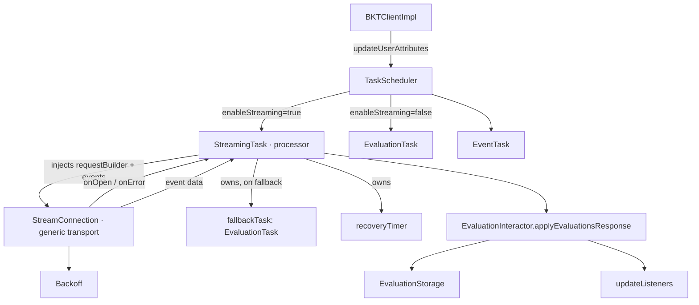
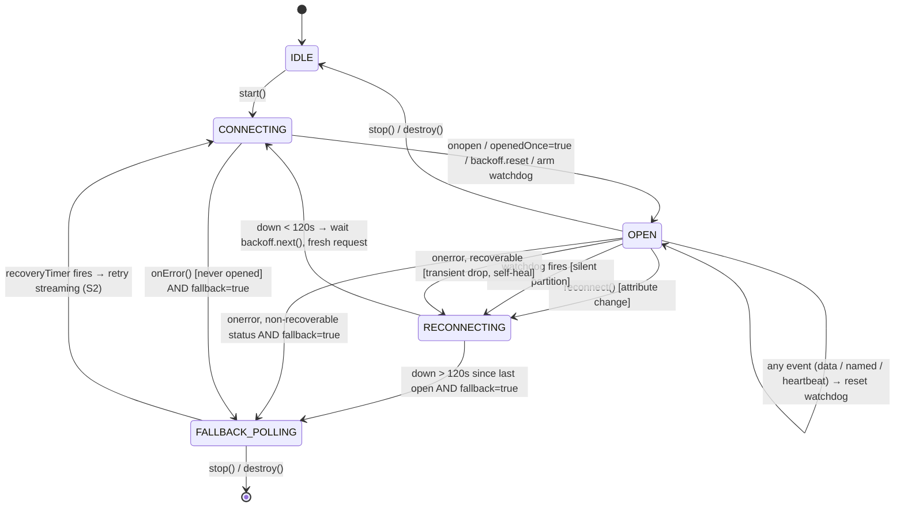

# SSE Implementation Plan V3: JavaScript SDK

Supersedes [`SSE_IMPLEMENTATION_V2.md`](./SSE_IMPLEMENTATION_V2.md). V3 keeps **every**
correction from V2 (the 8 review findings) and folds in the **client-side** improvements
identified in [`SSE_V2_VS_LAUNCHDARKLY_COMPARISON.md`](./SSE_V2_VS_LAUNCHDARKLY_COMPARISON.md).

**Ground rules carried from the comparison:**
- **No backend changes.** The backend is fixed — no new event types, no `ping`/poke
  message, no assumption about heartbeat *shape*. Everything here is client-side.
- The SDK reuses the existing `GetEvaluationsResponse` payload that the polling path
  already consumes; the stream is expected to deliver that same payload inline.
- Streaming stays strictly **opt-in**; polling remains the default. No public API removed.

---

## Changes from V2 (comparison findings folded in)

| ID | From comparison | What V3 adds | Touches backend? |
|---|---|---|---|
| S1 | No backoff/jitter | `Backoff` util (exponential + jitter + reset-after-healthy); used by **every** reconnect path | No |
| S2 | One-way permanent polling fallback | `StreamingTask` owns a **recovery timer**; after fallback it retries streaming | No |
| S3 | No error classification | Transport reads `err.status` when available and uses `isRecoverableStatus()` to decide retry vs. stop; documents browser's no-status limitation | No |
| S4 | God-object `StreamingTask` | Split into **transport** (`StreamConnection`) ⟂ **processor** (`StreamingTask`) | No |
| S5 | Brittle `=== globalThis.EventSource` sniffing | Resolve an explicit `eventSourceHeadersSupported` boolean at config time | No |
| S6 | Watchdog coupled to a named `heartbeat` | Idle watchdog resets on **any** received bytes/event (read-timeout semantics) | No |
| S7 | Event-after-stop races | `stopped`/`running` guard re-checked **after every `await`** | No |

Everything V2 already fixed (opt-in config, reuse `GetEvaluationsResponse`, extract
`applyEvaluationsResponse`, scheduler swap, `eventSource` from `config()` not
`PlatformModule`, named events via `addEventListener`, fallback owned by the task,
attribute-change reconnect driven externally) is **retained unchanged**.

---

## Architecture (V3 — transport / processor split, S4)



**Separation of concerns (S4):**

| Layer | File | Owns |
|---|---|---|
| **Transport** (generic, reusable) | `StreamConnection.ts` | The `EventSource` instance, reconnect with **backoff+jitter** (S1), the **idle watchdog/read-timeout** (S6), **error classification** (S3). Self-heals transient drops; emits `onOpen` / `onError` (give-up signal) and routes caller-named events. **URL, headers, and event names are injected** — it knows nothing about evaluations. |
| **Processor** | `StreamingTask.ts` (`ScheduledTask`) | The evaluation contract: the `/stream_evaluations` route, the **browser-vs-Node/RN request profile** (`buildRequest`), the `evaluations`/`heartbeat` event names, and parsing → `applyEvaluationsResponse`. Owns the **fallback `EvaluationTask`** and the **recovery timer** (S2); the stop guard (S7). |

---

## Connection state machine (V3)



Differences from V2's machine:
- Reconnects go through **`Backoff`** (S1), not a fixed delay.
- `onerror` is **classified** (S3): a brief transient drop *after* the stream opened
  (`openedOnce && recoverable`) self-heals in the transport; **never-opened** or a
  **non-recoverable** status reports `onError()` and the processor falls back.
- **Opened-then-unhealthy > 120s** also reports `onError()` (Option B) — bounds stale data
  and restores the polling safety net, which matters most on the statusless browser path.
- Fallback is **recoverable** (S2): `recoveryTimer` re-attempts streaming.
- Watchdog resets on **any** event (S6).

---

## Step-by-step Implementation

### Step 1 — Config (`src/BKTConfig.ts`)

Add to `RawBKTConfig`:
```ts
// User-provided EventSource constructor (required for Node.js / React Native)
eventSource?: EventSourceLike
// Enable SSE streaming (default: false — polling stays the default)
enableStreaming?: boolean
// Fall back to polling when SSE cannot be used (default: true)
streamingFallbackToPolling?: boolean
// Override header-capability detection (S5). When omitted it is derived:
// a user-supplied eventSource is assumed to support request headers
// (the 'eventsource' and 'react-native-sse' packages do); relying on the
// browser-native globalThis.EventSource means headers are NOT supported.
eventSourceHeadersSupported?: boolean
```

Add to resolved `BKTConfig`:
```ts
eventSource: EventSourceLike | undefined
enableStreaming: boolean
streamingFallbackToPolling: boolean
eventSourceHeadersSupported: boolean
```

> The SSE **endpoint path is an internal detail, not a user-facing config option** — the
> SDK user should not need to know the route. It lives as a module constant in the
> streaming code (see Step 6), matching how `ApiClient` references `/get_evaluations` /
> `/register_events` inline. A new backend route is a one-line constant change, not a
> public config addition.

In the `defineBKTConfig` result literal (follow the `??` pattern, **no spread** —
`no-spread-after-defaults` rule):
```ts
eventSource: config.eventSource ?? globalThis.EventSource,
enableStreaming: config.enableStreaming ?? false,
streamingFallbackToPolling: config.streamingFallbackToPolling ?? true,
// S5: explicit, deterministic capability — no runtime identity sniffing later.
// If the user injected an EventSource (Node/RN), assume header support; the
// browser-native default does not support headers.
eventSourceHeadersSupported:
  config.eventSourceHeadersSupported ?? config.eventSource !== undefined,
```

Validation (after the existing `fetch` check):
```ts
if (result.enableStreaming && !result.eventSource) {
  throw new IllegalArgumentException(
    'enableStreaming requires an EventSource implementation. ' +
    'Provide config.eventSource (e.g. the "eventsource" npm package for Node.js)',
  )
}
```

> Capability is resolved **once, at config time**, against whether the *user* provided
> `eventSource` — captured before the `globalThis.EventSource` default is applied. This is
> the S5 fix: `StreamConnection` reads a boolean, it never compares constructors at
> runtime.

---

### Step 2 — `src/internal/streaming/Backoff.ts` (S1)

Exponential backoff with jitter and reset-after-healthy, mirroring LaunchDarkly's
`DefaultBackoff` / `react-native-sse` math.

```ts
const DEFAULT_INITIAL_DELAY_MILLIS = 1_000
const MAX_DELAY_MILLIS = 30_000        // cap
const JITTER_RATIO = 0.5               // 50%–100% of computed delay
const RESET_INTERVAL_MILLIS = 60_000   // healthy this long → reset attempts

export class Backoff {
  private attempt = 0
  private lastSuccessAt = 0

  constructor(
    private readonly initialDelayMillis = DEFAULT_INITIAL_DELAY_MILLIS,
    private readonly maxDelayMillis = MAX_DELAY_MILLIS,
    private readonly resetIntervalMillis = RESET_INTERVAL_MILLIS,
    private readonly now: () => number = Date.now,
  ) {}

  // Call when a connection opens successfully.
  success(): void {
    // Only reset the counter if the connection stayed healthy long enough,
    // otherwise a flapping endpoint keeps resetting to the minimum delay.
    if (this.lastSuccessAt && this.now() - this.lastSuccessAt > this.resetIntervalMillis) {
      this.attempt = 0
    }
    this.lastSuccessAt = this.now()
  }

  // Call to get the delay before the next reconnect attempt.
  nextDelayMillis(): number {
    const base = Math.min(
      this.initialDelayMillis * 2 ** this.attempt,
      this.maxDelayMillis,
    )
    this.attempt++
    // jitter: subtract up to JITTER_RATIO of the computed delay
    return base - Math.trunc(Math.random() * JITTER_RATIO * base)
  }

  reset(): void {
    this.attempt = 0
  }
}
```

> Inject `now` so tests are deterministic; `Math.random` jitter is fine to leave live in
> unit tests (assert the value is within `[base*0.5, base]`).

---

### Step 3 — `src/internal/streaming/httpStatus.ts` (S3)

Mirrors LD's `isHttpRecoverable`: 4xx are fatal **except** 400/408/429.

```ts
export function isRecoverableStatus(status: number | undefined): boolean {
  if (status === undefined) {
    // No status available (e.g. browser-native EventSource onerror) — we cannot
    // distinguish a forbidden key from a transient drop, so we keep retrying.
    return true
  }
  if (status >= 400 && status < 500) {
    return status === 400 || status === 408 || status === 429
  }
  return true
}
```

---

### Step 4 — `src/internal/streaming/EventSourceLike.ts` (S6 needs `addEventListener`)

```ts
export interface EventSourceLike {
  new (url: string, init?: EventSourceLikeInit): EventSourceInstance
}

export interface EventSourceInstance {
  readonly readyState: number
  onopen: ((ev: unknown) => void) | null
  onmessage: ((ev: MessageEventLike) => void) | null
  // Some implementations surface an HTTP status on the error event (Node/RN).
  // Browser-native EventSource does not — onerror is a bare Event.
  onerror: ((ev: { status?: number } | unknown) => void) | null
  addEventListener(type: string, listener: (ev: MessageEventLike) => void): void
  removeEventListener(type: string, listener: (ev: MessageEventLike) => void): void
  close(): void
}

export interface MessageEventLike {
  data?: string
}

export interface EventSourceLikeInit {
  // Supported by 'eventsource' (Node.js) and 'react-native-sse'.
  // Ignored by browser-native EventSource (headers not supported).
  headers?: Record<string, string>
}
```

`eventsource` (Node), `react-native-sse`, and browser-native `EventSource` all implement
`addEventListener`/`removeEventListener` — so named events (`evaluations`, `heartbeat`)
are receivable everywhere (V2 finding #6).

---

### Step 5 — `src/internal/streaming/StreamConnection.ts` (generic transport: S1, S3, S6, S7)

A **domain-agnostic** SSE transport. It owns one logical connection: connect, reconnect
with backoff, an idle watchdog reset by **any** event, and error classification. It knows
nothing about evaluations — the URL, request headers, and event names are all supplied by
the caller, so the same class could drive any Bucketeer SSE stream.

```ts
import { Backoff } from './Backoff'
import {
  EventSourceInstance,
  EventSourceLike,
  EventSourceLikeInit,
  MessageEventLike,
} from './EventSourceLike'
import { isRecoverableStatus } from './httpStatus'

const WATCHDOG_TIMEOUT_MILLIS = 70_000 // > backend heartbeat interval, S6
// If a stream that HAS opened then stays unhealthy this long, stop self-healing
// and let the caller fall back to polling (the caller's recovery timer retries
// streaming later). Bounds stale-data time; matches LaunchDarkly's ~120s.
const OPEN_FALLBACK_TIMEOUT_MILLIS = 120_000

export interface StreamConnectionCallbacks {
  onOpen: () => void
  // Called when this connection gives up: never opened, a non-recoverable status
  // (e.g. 401/403), OR it opened but stayed unhealthy past OPEN_FALLBACK_TIMEOUT.
  // The caller decides what to do next. Brief transient drops self-heal here and
  // do NOT call this.
  onError: () => void
}

export interface StreamConnectionOptions {
  eventSource: EventSourceLike
  // Builds a fresh request on every (re)connect, so the caller can refresh the
  // URL AND headers (e.g. after a user-attribute change). The transport never
  // constructs these itself.
  requestBuilder: () => { url: string; init?: EventSourceLikeInit }
  // Caller names the events. 'message' maps to es.onmessage; any other name to
  // es.addEventListener(name). Every received event resets the watchdog, so a
  // no-op handler (e.g. heartbeat) still counts as liveness.
  events: Record<string, (data: string) => void>
  callbacks: StreamConnectionCallbacks
}

export class StreamConnection {
  private es: EventSourceInstance | null = null
  private watchdog: ReturnType<typeof setTimeout> | undefined
  private reconnectTimer: ReturnType<typeof setTimeout> | undefined
  private readonly backoff = new Backoff()
  private openedOnce = false
  private lastOpenAt = 0   // timestamp of the most recent successful open
  private active = false

  constructor(private readonly options: StreamConnectionOptions) {}

  start(): void {
    this.active = true
    this.openConnection()
  }

  // External reconnect (e.g. attribute change) — fresh request, reset backoff.
  reconnect(): void {
    if (!this.active) return
    this.backoff.reset()
    this.closeEventSource()
    this.openConnection()
  }

  stop(): void {
    this.active = false
    this.cancelWatchdog()
    clearTimeout(this.reconnectTimer)
    this.reconnectTimer = undefined
    this.closeEventSource()
  }

  // --- private ---

  private openConnection(): void {
    const { url, init } = this.options.requestBuilder()
    const es = new this.options.eventSource(url, init)
    this.es = es

    es.onopen = () => {
      this.openedOnce = true
      this.lastOpenAt = Date.now()
      this.backoff.success()   // S1
      this.resetWatchdog()     // S6
      this.options.callbacks.onOpen()
    }

    // Wire every caller-named event generically; each resets the watchdog.
    Object.entries(this.options.events).forEach(([name, handler]) => {
      const wrapped = (ev: MessageEventLike) => {
        this.resetWatchdog()           // S6 — any byte counts as liveness
        if (ev?.data !== undefined) handler(ev.data)
      }
      if (name === 'message') {
        es.onmessage = wrapped
      } else {
        es.addEventListener(name, wrapped)
      }
    })

    es.onerror = (ev) => {
      const status = (ev as { status?: number } | null)?.status
      const recoverable = isRecoverableStatus(status)
      if (this.openedOnce && recoverable) {
        // Transient drop after a healthy connection → self-heal with backoff (S1).
        // Stay connected; the caller is not involved.
        this.scheduleReconnect()
        return
      }
      // Never opened (endpoint absent / first-connect failure) OR a non-recoverable
      // status (S3, e.g. 401/403) → give up this connection and let the caller decide.
      this.closeEventSource()
      this.options.callbacks.onError()
    }

    this.resetWatchdog()
  }

  private scheduleReconnect(): void {
    this.closeEventSource()
    if (!this.active) return
    // Both the onerror self-heal path and the watchdog funnel through here. If the
    // stream opened but has stayed unhealthy past the fallback timeout, give up and
    // let the caller fall back to polling (Option B). Browser onerror is statusless,
    // so without this an opened-then-broken browser stream would retry forever.
    if (this.openedOnce && Date.now() - this.lastOpenAt > OPEN_FALLBACK_TIMEOUT_MILLIS) {
      this.options.callbacks.onError()
      return
    }
    const delay = this.backoff.nextDelayMillis() // S1
    this.reconnectTimer = setTimeout(() => this.openConnection(), delay)
  }

  private resetWatchdog(): void {
    this.cancelWatchdog()
    this.watchdog = setTimeout(() => {
      // Silent partition: no traffic at all within the window → reconnect.
      this.scheduleReconnect()
    }, WATCHDOG_TIMEOUT_MILLIS)
  }

  private cancelWatchdog(): void {
    clearTimeout(this.watchdog)
    this.watchdog = undefined
  }

  private closeEventSource(): void {
    this.cancelWatchdog()
    this.es?.close()
    this.es = null
  }
}
```

> The transport is now reusable: URL, headers, and event names are injected. All
> evaluation specifics (the `/stream_evaluations` route, the browser-vs-header request
> profiles, the `evaluations`/`heartbeat` event names, and payload parsing) live in the
> `StreamingTask` processor (Step 6).

> **Reconnect vs. fallback responsibility (clean contract):**
> - The transport **self-heals brief drops**: a transient error *after* the stream had
>   opened (`openedOnce && recoverable`) → backoff reconnect, stays streaming, processor
>   not involved.
> - It **gives up via `onError()`** in three cases, and the **processor** owns the
>   fallback-to-polling decision (it owns the `EvaluationTask`):
>   1. never opened (endpoint absent / first-connect failure),
>   2. a non-recoverable status (e.g. 401/403),
>   3. **opened but stayed unhealthy past `OPEN_FALLBACK_TIMEOUT_MILLIS` (120s)** — the
>      decided behavior (Option B). `lastOpenAt` tracks the last healthy open; once a
>      reconnect attempt finds the stream has been down longer than 120s, the transport
>      stops retrying and reports `onError()`. The processor falls back to polling and its
>      5-min recovery timer (S2) periodically retries streaming.
> - This keeps the transport payload-agnostic and needs no `hasOpened()` getter.
> - Why 120s matters most on **browser**: native `EventSource.onerror` is statusless, so
>   every post-open error is "recoverable" and would otherwise retry forever — leaving the
>   client on stale flags with no polling safety net. The 120s cap bounds that.

---

### Step 6 — `src/internal/streaming/StreamingTask.ts` (processor: S2, S4, S7)

Implements `ScheduledTask`. Owns the evaluation contract — the SSE route, the
browser-vs-Node/RN request profile, the event names, and payload parsing — and drives the
generic `StreamConnection`. Also owns the **fallback** `EvaluationTask` + **recovery** timer.

```ts
import { Component } from '../di/Component'
import { requiredInternalConfig } from '../InternalConfig'
import { GetEvaluationsResponse } from '../model/response/GetEvaluationsResponse'
import { EvaluationTask } from '../scheduler/EvaluationTask'
import { ScheduledTask } from '../scheduler/ScheduledTask'
import { EventSourceLikeInit } from './EventSourceLike'
import { StreamConnection } from './StreamConnection'

// Internal SSE route — not a user-facing config option (matches ApiClient's
// inline `/get_evaluations` convention). A new route is a one-line change here.
const STREAM_EVALUATIONS_PATH = '/stream_evaluations'

const RECOVERY_INTERVAL_MILLIS = 5 * 60_000 // retry streaming after 5 min on fallback (S2)

export class StreamingTask implements ScheduledTask {
  private connection: StreamConnection | null = null
  private fallbackTask: EvaluationTask | null = null
  private recoveryTimer: ReturnType<typeof setTimeout> | undefined
  private running = false

  constructor(private readonly component: Component) {}

  isRunning(): boolean {
    return this.running
  }

  start(): void {
    this.running = true
    this.openStream()
  }

  // Called by TaskScheduler.reconnectStreaming() on attribute change.
  reconnect(): void {
    if (!this.running) return
    if (this.connection) {
      // transport re-invokes requestBuilder → fresh URL + headers with new attrs
      this.connection.reconnect()
    } else {
      // currently on polling fallback — go straight back to streaming
      this.stopFallback()
      this.openStream()
    }
  }

  stop(): void {
    this.running = false
    this.connection?.stop()
    this.connection = null
    this.stopFallback()
    clearTimeout(this.recoveryTimer)
    this.recoveryTimer = undefined
  }

  // --- private ---

  private openStream(): void {
    const config = requiredInternalConfig(this.component.config())
    if (!config.eventSource) return // guarded by config validation, defensive here
    this.connection = new StreamConnection({
      eventSource: config.eventSource,
      // re-read on every (re)connect so reconnect picks up fresh user attributes
      requestBuilder: () => this.buildRequest(),
      events: {
        evaluations: (data) => this.handleData(data),
        message: (data) => this.handleData(data),
        heartbeat: () => {}, // liveness only; transport resets the watchdog
      },
      callbacks: {
        // streaming is healthy again — drop any fallback/recovery
        onOpen: () => this.stopFallback(),
        onError: () => this.handleError(),
      },
    })
    this.connection.start()
  }

  // Two request profiles. Browser-native EventSource cannot set headers, so on the
  // browser everything (incl. apiKey + user identification) rides the query string.
  // Node / React Native support headers, so the credential AND the user
  // identification go in headers and nothing sensitive lands in the URL.
  // NOTE: the X-Bucketeer-* header names are provisional — confirm with the backend
  // team (see Backend dependencies).
  private buildRequest(): { url: string; init?: EventSourceLikeInit } {
    const config = requiredInternalConfig(this.component.config())
    const user = this.component.userHolder().get()
    const base = `${config.apiEndpoint}${STREAM_EVALUATIONS_PATH}`

    if (config.eventSourceHeadersSupported) {
      return {
        url: base,
        init: {
          headers: {
            Authorization: config.apiKey,
            'X-Bucketeer-Tag': config.featureTag,
            'X-Bucketeer-User-Id': user.id,
            'X-Bucketeer-User-Attributes': JSON.stringify(user.data ?? {}),
            'X-Bucketeer-Source-Id': String(config.sourceId),
            'X-Bucketeer-Sdk-Version': config.sdkVersion,
          },
        },
      }
    }

    const params = new URLSearchParams({
      apiKey: config.apiKey,
      tag: config.featureTag,
      userId: user.id,
      userAttributes: JSON.stringify(user.data ?? {}),
      sourceId: String(config.sourceId),
      sdkVersion: config.sdkVersion,
    })
    return { url: `${base}?${params.toString()}` }
  }

  // Called only when the transport gives up (never opened, or non-recoverable
  // status). Transient drops after a healthy connection self-heal in the transport
  // and never reach here.
  private handleError(): void {
    if (!this.running) return
    if (this.component.config().streamingFallbackToPolling) {
      this.connection?.stop()
      this.connection = null
      this.startFallback()
    }
  }

  private async handleData(data: string): Promise<void> {
    if (!this.running) return // S7
    let response: GetEvaluationsResponse
    try {
      response = JSON.parse(data) as GetEvaluationsResponse
    } catch {
      return // malformed — ignore; watchdog covers true silence
    }
    await this.component.evaluationInteractor().applyEvaluationsResponse(response)
    if (!this.running) return // S7 — re-check after await
  }

  private startFallback(): void {
    if (!this.fallbackTask) {
      this.fallbackTask = new EvaluationTask(this.component)
      this.fallbackTask.start()
    }
    // S2: periodically attempt to return to streaming.
    clearTimeout(this.recoveryTimer)
    this.recoveryTimer = setTimeout(() => {
      if (!this.running) return
      this.stopFallback()
      this.openStream()
    }, RECOVERY_INTERVAL_MILLIS)
  }

  private stopFallback(): void {
    this.fallbackTask?.stop()
    this.fallbackTask = null
    clearTimeout(this.recoveryTimer)
    this.recoveryTimer = undefined
  }
}
```

> Recovery loop (S2): on fallback, start polling **and** arm a 5-min recovery timer. When
> it fires, stop polling and re-open the stream. If the stream opens (`onOpen`), the
> fallback stays off; if it errors again, `handleError` restarts the fallback + a fresh
> recovery timer. This is bidirectional without LD's full orchestrator.

---

### Step 7 — `src/internal/evaluation/EvaluationInteractor.ts` (extract apply path)

Extract the success block of `fetch` (currently lines ~50–82) into a public method that
both polling and streaming call — identical cache + listener semantics.

```ts
async applyEvaluationsResponse(
  response: GetEvaluationsResponse,
): Promise<void> {
  let shouldNotify: boolean
  if (response.evaluations.forceUpdate) {
    await this.evaluationStorage.deleteAllAndInsert(
      response.userEvaluationsId,
      response.evaluations.evaluations ?? [],
      response.evaluations.createdAt,
    )
    shouldNotify = true
  } else {
    shouldNotify = await this.evaluationStorage.update(
      response.userEvaluationsId,
      response.evaluations.evaluations ?? [],
      response.evaluations.archivedFeatureIds ?? [],
      response.evaluations.createdAt,
    )
  }
  await this.evaluationStorage.clearUserAttributesUpdated()
  if (shouldNotify) {
    Object.values(this.updateListeners).forEach((listener) => listener())
  }
}
```

`fetch` keeps its request code and replaces the inlined success block with:
```ts
if (result.type === 'success') {
  await this.applyEvaluationsResponse(result.value)
}
return result
```

No new flag getters (V2 finding #4 stays resolved — `StreamingTask` never reads
`userAttributesUpdated`).

---

### Step 8 — `src/internal/scheduler/TaskScheduler.ts` (swap + reconnect signal)

```ts
import { Component } from '../di/Component'
import { EvaluationTask } from './EvaluationTask'
import { EventTask } from './EventTask'
import { ScheduledTask } from './ScheduledTask'
import { StreamingTask } from '../streaming/StreamingTask'

export class TaskScheduler {
  private schedulers: ScheduledTask[]

  constructor(private component: Component) {
    const mainTask = component.config().enableStreaming
      ? new StreamingTask(component)
      : new EvaluationTask(component)
    this.schedulers = [mainTask, new EventTask(component)]
  }

  start() {
    this.schedulers.forEach((scheduler) => scheduler.start())
  }

  stop() {
    this.schedulers.forEach((scheduler) => scheduler.stop())
  }

  // Called by BKTClientImpl.updateUserAttributes when streaming is active.
  reconnectStreaming(): void {
    const task = this.schedulers.find((s) => s instanceof StreamingTask)
    ;(task as StreamingTask | undefined)?.reconnect()
  }
}
```

`EventTask` unchanged. No `PlatformModule` edits (V2 finding #7).

---

### Step 9 — `src/BKTClient.ts` (attribute change → reconnect)

`BKTClientImpl.updateUserAttributes` (currently `src/BKTClient.ts:177-182`) gains **one
line** after marking attributes updated (V2 Gap 1) — the first two lines are the existing
body, unchanged:

```ts
async updateUserAttributes(
  attributes: Record<string, string>,
): Promise<void> {
  this.component.userHolder().updateAttributes((_prev) => ({ ...attributes }))
  await this.component.evaluationInteractor().setUserAttributesUpdated()
  // NEW: signal an active StreamingTask to reconnect with the new attributes.
  this.taskScheduler?.reconnectStreaming()
}
```

`reconnectStreaming()` is a no-op when polling is active (the `find` returns nothing), so
this is safe regardless of `enableStreaming`.

---

## Request profiles per platform

Two deliberately different profiles, branching on the resolved `eventSourceHeadersSupported`
boolean (S5) — no `=== globalThis.EventSource` runtime sniffing. `buildRequest()` (Step 6)
is the single place this is decided.

| Platform | `EventSource` | `eventSourceHeadersSupported` | Credential | User identification | URL |
|---|---|---|---|---|---|
| Browser | `globalThis.EventSource` (default, user passes nothing) | `false` (derived) | `apiKey` **query param** | **query params** | all params in query string |
| Node.js | `eventsource` package (user passes it) | `true` (derived) | `Authorization` **header** | **`X-Bucketeer-*` headers** | route only, no params |
| React Native | `react-native-sse` (user passes it) | `true` (derived) | `Authorization` **header** | **`X-Bucketeer-*` headers** | route only, no params |

> The browser path is forced to put everything (including `apiKey`) in the query string —
> native `EventSource` cannot set headers. Node/RN keep **both** the credential and the
> user identification out of the URL. This intentional browser-vs-server difference
> requires the streaming endpoint to accept header-based identification on the
> header-capable path — see **Backend dependencies**.

---

## Reconnect / fallback / recovery behavior

| Scenario | Behavior |
|---|---|
| Transient drop (TCP close), already opened | `StreamConnection` backoff-reconnects (S1); stays streaming |
| Silent partition (no bytes) | Idle watchdog fires after ~70 s → backoff reconnect (S6) |
| Recoverable HTTP error (5xx / 408 / 429 / no status) | Backoff reconnect (S1, S3) |
| **Opened, then unhealthy > 120 s** (backoff retries keep failing) | Transport `onError()` (Option B) → processor falls back to polling; recovery timer retries streaming (S2) |
| Non-recoverable HTTP error (401/403/404…) **with** status | transport `onError()` → processor falls back to polling if enabled (S3) |
| Backend never opens SSE (endpoint absent) | transport `onError()` (never opened) → fallback to polling (if enabled) |
| On fallback | Polling runs **and** 5-min recovery timer retries streaming (S2) |
| Streaming recovers after fallback | `onOpen` stops fallback + recovery timer (S2) |
| User attributes changed | `reconnect()` — transport re-invokes `requestBuilder` for a fresh URL/headers (streaming), or jump back from polling to streaming |
| `destroy()` / `stop()` | `StreamingTask.stop()` → connection stop (watchdog + reconnect + ES closed) + fallback stop + recovery cancelled |

---

## Security — finding #8 (now browser-only)

The two-profile design **narrows the exposure to the browser**. Browser-native
`EventSource` cannot set headers, so on the browser path the `apiKey` **and the user
identification** (`userId`, `userAttributes`) ride the URL query string and land in
server/proxy logs and history. There is no client-only fix on the browser while the
backend is fixed. Browser mitigations:
1. Confirm the backend team accepts query-param exposure (key + identification) on the
   browser streaming path.
2. Prefer a short-lived / streaming-scoped credential for SSE where available.
3. JSDoc the exposure on the `eventSource` field.

**Node.js and React Native are now fully clean:** `buildRequest()` puts both the
credential (`Authorization`) and the user identification in **headers**, so nothing
sensitive appears in the URL on those platforms.

---

## Testing (Vitest, `test/` mirrors `src/`)

**`Backoff` (S1)**
| Case | Assert |
|---|---|
| Successive `nextDelayMillis()` | grows ~exponentially, capped at 30 s, each within `[base*0.5, base]` |
| `success()` after > reset interval | attempt counter resets |
| `success()` while flapping (< reset interval) | counter does **not** reset |

**`isRecoverableStatus` (S3)** — 400/408/429 → true; 401/403/404 → false; 500/undefined → true.

**`StreamConnection` (generic transport — fed a fake `eventSource` + `requestBuilder`)**
| Case | Assert |
|---|---|
| A registered no-op event (e.g. `heartbeat`) fires | watchdog reset; **no** reconnect loop; handler invoked (S6) |
| A registered data event (named or `message`) fires | watchdog reset; handler called with `ev.data` (S6) |
| `onerror` recoverable/absent **after** open, within 120 s of last open | backoff reconnect scheduled, reconnects; `onError` **not** called (S1, S3) |
| `onerror` recoverable/absent **after** open, but > 120 s since last open | `onError()` called; stops retrying (Option B; use fake timers) |
| `onerror` recoverable/absent **before** ever opening | `onError()` called; no self-reconnect (S3) |
| `onerror` with 403 status | `onError()` called; no reconnect (S3) |
| `reconnect()` | `requestBuilder` re-invoked → new `{url, init}` used (S1) |
| `stop()` | watchdog + reconnect timer cancelled; ES closed |

**`StreamingTask` (processor)**
| Case | Assert |
|---|---|
| `buildRequest`, `headersSupported=false` (browser) | URL query has `apiKey` + `tag`/`userId`/`userAttributes`/…; `init` is `undefined` |
| `buildRequest`, `headersSupported=true` (Node/RN) | URL is route only (no query); `init.headers` has `Authorization` + `X-Bucketeer-*` identification; URL has **no** `apiKey` |
| `reconnect()` after attribute change | next `buildRequest` reflects new user attributes (header or query per profile) |
| data event → valid payload | `applyEvaluationsResponse` called once |
| data event after `stop()` | guard prevents apply/notify (S7) |
| `onError()` (never-opened or fatal) + fallback enabled | `EvaluationTask` started |
| `onError()` + fallback **disabled** | no `EvaluationTask`; stays streaming-only |
| recovery timer fires while on fallback | fallback stopped, stream re-opened (S2) |
| stream `onOpen` after fallback | fallback + recovery cancelled (S2) |
| `stop()` while on fallback | fallback stopped, recovery cancelled |

**`TaskScheduler`** — `enableStreaming:true` → `StreamingTask` in array; `false` →
`EvaluationTask`; `reconnectStreaming()` no-ops when polling.

**`defineBKTConfig`** — `enableStreaming:true` + no `EventSource` → `IllegalArgumentException`;
capability derivation (`eventSourceHeadersSupported` defaults).

**`EvaluationInteractor.applyEvaluationsResponse`** — same cache + listener behavior as
polling `fetch` (forceUpdate vs update; notify-on-change).

**E2E (`e2e/`)** — flip a flag on the backend, assert update arrives via SSE in < 1 s.

---

## Backend dependencies

Most of V3 is client-side and works with the existing payload and whatever keep-alive the
backend already emits. **One accepted exception** introduces a backend dependency that is
being **raised with the backend team**:

1. **Header-based identification on the header-capable path (Node.js / React Native).**
   To keep the credential and user data out of the URL on platforms that support request
   headers, the streaming endpoint must read identification from headers on those
   requests, in addition to the query-string form the browser is forced to use:

   | Logical field | Browser (query param) | Node / RN (header) |
   |---|---|---|
   | credential | `apiKey` | `Authorization` |
   | feature tag | `tag` | `X-Bucketeer-Tag` |
   | user id | `userId` | `X-Bucketeer-User-Id` |
   | user attributes (JSON) | `userAttributes` | `X-Bucketeer-User-Attributes` |
   | source id | `sourceId` | `X-Bucketeer-Source-Id` |
   | sdk version | `sdkVersion` | `X-Bucketeer-Sdk-Version` |

   The `X-Bucketeer-*` header names are **provisional** — to be confirmed with the backend
   team. This is the deliberate browser-vs-server difference; the browser path is
   unavoidable (native `EventSource` cannot set headers).

2. **Payload + keep-alive.** The stream is expected to deliver the existing
   `GetEvaluationsResponse` inline. Idle detection resets on **any** received bytes
   (S6), so it works with whatever keep-alive the backend already sends — no new event
   type required.

---

## Effort

| | |
|---|---|
| New files | 5 — `Backoff.ts`, `httpStatus.ts`, `EventSourceLike.ts`, `StreamConnection.ts`, `StreamingTask.ts` |
| Modified files | 4 — `BKTConfig.ts`, `EvaluationInteractor.ts`, `TaskScheduler.ts`, `BKTClient.ts` |
| `PlatformModule` | No edits (V2 finding #7) |
| Backend | **One accepted change** — header-based identification on the Node/RN streaming path (see Backend dependencies); browser path needs query params only |
| Backward compatibility | Polling default unchanged; SSE strictly opt-in; no public API removed |

---

## Traceability — every comparison suggestion lands somewhere

| Suggestion | Implemented in |
|---|---|
| S1 backoff + jitter | `Backoff.ts`; used by `StreamConnection.scheduleReconnect` / watchdog |
| S2 recoverable fallback | `StreamingTask` `recoveryTimer` + `onOpen` cancel |
| S3 error classification | `httpStatus.ts` + `StreamConnection.onerror` |
| S4 transport/processor split | `StreamConnection` (transport) ⟂ `StreamingTask` (processor) |
| S5 explicit capability | `eventSourceHeadersSupported` resolved in `defineBKTConfig` |
| S6 read-timeout idle detection | `StreamConnection` watchdog reset by **any** event |
| S7 stop guard | `StreamingTask.handleData` re-checks `running` after `await` |
