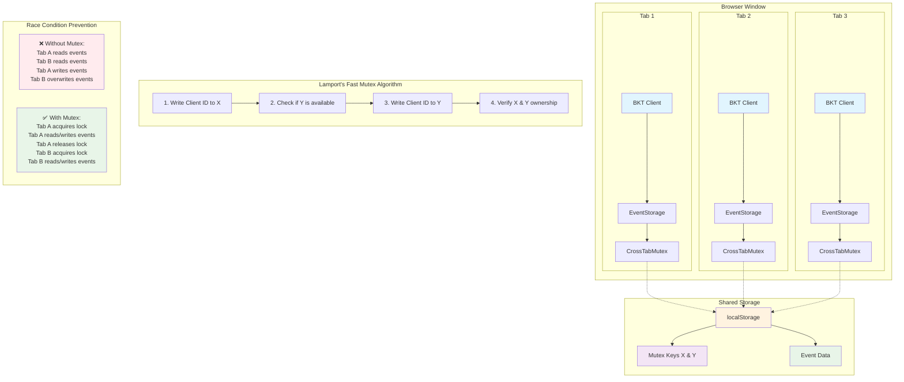
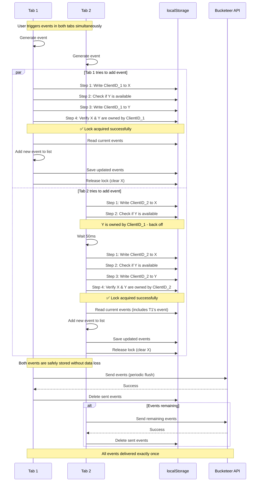

# Cross-Tab Synchronization

## Problem Statement

When users open multiple tabs of the same web application, each tab runs its own instance of the Bucketeer JavaScript SDK. This creates race conditions when accessing shared localStorage, leading to:

1. **Data Loss**: One tab's changes can overwrite another tab's changes
2. **Duplicate Events**: The same event might be sent multiple times by different tabs
3. **Inconsistent State**: Events might get lost or duplicated during concurrent access

## Root Cause

The issue occurs in the `EventStorageImpl.add()` method, which performs a non-atomic read-modify-write operation:

```typescript
add(event: Event): void {
  const entity = this.getInternal(this.userId)  // READ
  entity.events.push(event)                     // MODIFY
  this.storage.set(entity)                      // WRITE
}
```

When multiple tabs execute this sequence simultaneously:

- Tab A reads the current events
- Tab B reads the current events (same data)
- Tab A adds an event and saves
- Tab B adds an event and saves (overwrites Tab A's changes)

## Solution Overview

The solution implements a **Cross-Tab Mutex** using localStorage and Lamport's Fast Mutex algorithm to provide exclusive access to shared resources across browser tabs.

### Architecture Diagram



### Key Components

1. **CrossTabMutex**: Implements mutual exclusion using Lamport's Fast Mutex algorithm
2. **ThreadSafeEventStorage**: Wraps EventStorage with mutex protection
3. **Automatic Fallback**: Falls back to regular storage if mutex operations fail
4. **Backward Compatibility**: Maintains existing API surface

## Implementation Details

### CrossTabMutex

The mutex implementation uses two localStorage keys (X and Y) to coordinate access:

```typescript
class CrossTabMutex {
  async lock(): Promise<void> {
    // Implementation of Lamport's Fast Mutex algorithm
    // 1. Write client ID to X
    // 2. Check if Y is available
    // 3. Write client ID to Y
    // 4. Verify X and Y are still owned by this client
  }

  async withLock<T>(fn: () => Promise<T>): Promise<T> {
    await this.lock()
    try {
      return await fn()
    } finally {
      await this.unlock()
    }
  }
}
```

### ThreadSafeEventStorage

Provides both synchronous (backward compatible) and asynchronous (thread-safe) methods:

```typescript
class ThreadSafeEventStorage implements EventStorage {
  // Synchronous methods for backward compatibility
  add(event: Event): void {
    /* ... */
  }

  // Asynchronous methods for cross-tab safety
  async addAsync(event: Event): Promise<void> {
    return this.mutex.withLockSync(() => {
      this.eventStorage.add(event)
    })
  }
}
```

### Automatic Detection

The SDK automatically enables cross-tab safety in browser environments:

```typescript
private shouldEnableCrossTabSafety(): boolean {
  // Check if we're in a browser environment
  if (typeof window === 'undefined' || typeof localStorage === 'undefined') {
    return false
  }
  return true
}
```

### Mutex Coordination Sequence

The following sequence diagram shows how the mutex coordinates access when multiple tabs try to add events simultaneously:



## Configuration Options

The mutex can be configured with the following options:

```typescript
interface CrossTabMutexOptions {
  timeout?: number // Maximum time to hold a lock (default: 5000ms)
  lockCheckInterval?: number // How often to check for lock availability (default: 50ms)
  maxRetries?: number // Maximum number of retry attempts (default: 100)
}
```

## Error Handling

The implementation includes robust error handling:

1. **Timeout Protection**: Locks automatically expire to prevent deadlocks
2. **Graceful Degradation**: Falls back to regular storage if mutex fails
3. **Best-effort Cleanup**: Unlock operations never throw errors
4. **Retry Logic**: Automatic retries with exponential backoff

## Performance Considerations

- **Minimal Overhead**: Only adds overhead when multiple tabs are actually contending
- **Non-blocking**: Uses async/await to avoid blocking the main thread
- **Efficient Polling**: Configurable polling intervals to balance responsiveness and CPU usage
- **Automatic Cleanup**: Expired locks are automatically cleaned up

## Browser Compatibility

The solution works in all modern browsers that support:

- localStorage (IE8+)
- Promises (or polyfill)
- setTimeout/clearTimeout

## Usage Examples

### Basic Usage (Automatic)

The cross-tab safety is enabled automatically in browser environments:

```typescript
import { initializeBKTClient } from '@bucketeer/javascript-client-sdk'

// Cross-tab safety is automatically enabled
const client = await initializeBKTClient({
  apiKey: 'your-api-key',
  apiEndpoint: 'https://api.bucketeer.io',
  userId: 'user-123',
  appVersion: '1.0.0',
})
```

### Manual Configuration

For custom timeout settings:

```typescript
// This would be added to BKTConfig in the future
const client = await initializeBKTClient({
  // ... other config
  crossTabSafety: {
    timeout: 3000,
    lockCheckInterval: 25,
    maxRetries: 120,
  },
})
```

## Testing Cross-Tab Behavior

To test the cross-tab synchronization:

1. Open your application in multiple tabs
2. Trigger events simultaneously in different tabs
3. Verify that all events are properly stored and sent
4. Check browser DevTools for any race condition warnings

## Monitoring

The implementation includes console warnings for troubleshooting:

```typescript
// Warnings you might see:
console.warn(
  'Failed to add event with cross-tab safety, falling back to sync:',
  error,
)
console.warn(
  'Failed to create thread-safe event storage, falling back to regular storage:',
  error,
)
```

## Migration Guide

### For Existing Applications

The solution is **fully backward compatible**. No code changes are required - cross-tab safety is automatically enabled when multiple tabs are detected.

### For New Applications

New applications can rely on the automatic cross-tab safety without any special configuration.

## Future Enhancements

Potential future improvements include:

1. **Web Locks API**: Use native Web Locks API when available (Chrome 69+)
2. **SharedArrayBuffer**: Use SharedArrayBuffer for even better performance
3. **Configuration Options**: Add BKTConfig options for fine-tuning
4. **Metrics**: Add telemetry for cross-tab coordination events

## References

- [Lamport's Fast Mutex Algorithm (1985)](http://research.microsoft.com/en-us/um/people/lamport/pubs/fast-mutex.pdf)
- [MDN Web Locks API](https://developer.mozilla.org/en-US/docs/Web/API/Web_Locks_API)
- [localStorage Cross-Tab Communication](https://developer.mozilla.org/en-US/docs/Web/API/Window/localStorage)

## Troubleshooting

### Common Issues

1. **High CPU Usage**: Reduce `lockCheckInterval` or increase `timeout`
2. **Deadlocks**: Locks automatically expire - check `timeout` setting
3. **Events Missing**: Check console for fallback warnings
4. **Performance Issues**: Monitor lock contention frequency

### Debug Information

Enable debug logging by setting:

```typescript
localStorage.setItem('bucketeer_debug', 'true')
```

This will show detailed information about lock acquisition and release.
